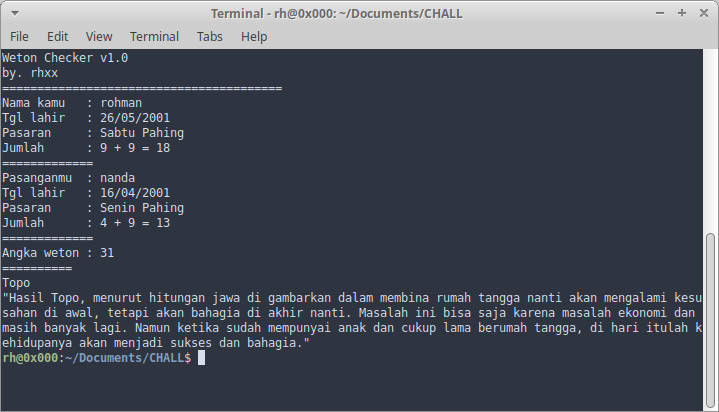

# Weton Jawa

Tool untuk menentukan kecocokan pasangan laki-laki dengan perempuan. berdasarkan Weton Jawa.

Gunakan sewajarnya, boleh percaya boleh tidak.

sumber : https://www.99.co/blog/indonesia/cara-menghitung-weton-jodoh/
## Penggunaan

```bash
$ git clone https://github.com/rohmnnn/weton-pasaran-jawa.git
$ cd weton-pasaran-jawa
$ python3 weton.py
```

# Screenshoot



